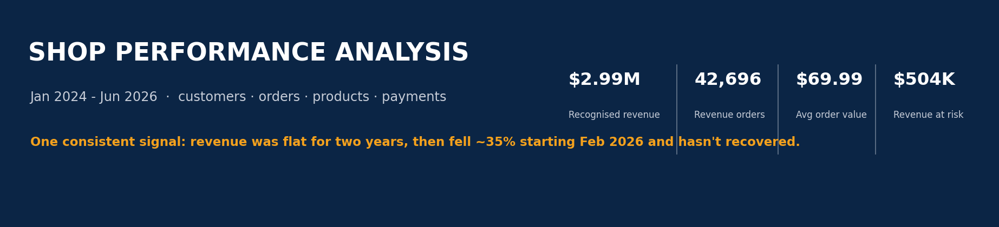
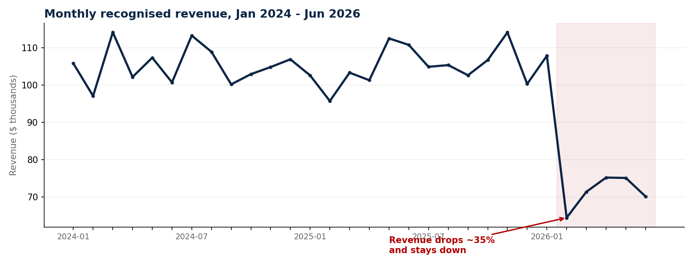
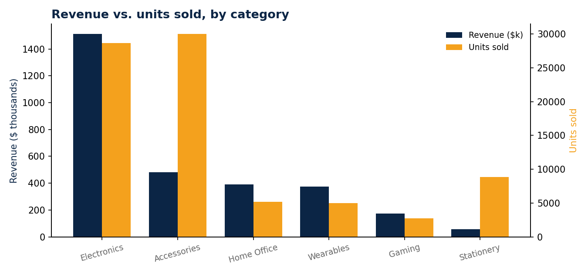
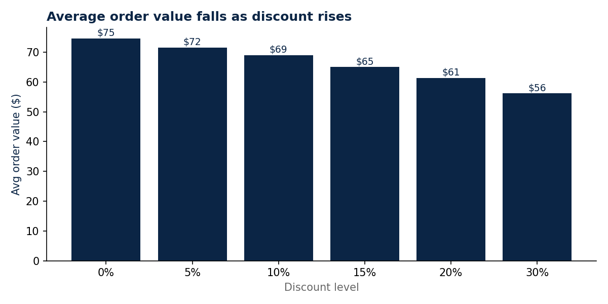

# How Is the Shop Performing?



A beginner data-analysis case study (customers, orders, products and payments for an online shop, Jan 2024–Jun 2026) turned into a plain-language answer for the Head of Operations, plus a live Excel dashboard for anyone who wants to dig further.

---

## Why this exists

The Head of Operations isn't a data person. They just want to know: **is the shop doing well, and what should we do next?** This repo takes four raw CSV files — messy, like real business data always is — and turns them into a clear story: what happened, what's driving it, and three things worth doing about it.

## Who this is for

- **The Head of Operations** — read the [Headline findings](#headline-findings) and [Recommendations](#three-recommendations) below, or open `Shop_Performance_Dashboard.xlsx` and go straight to the **Dashboard** tab.
- **Anyone who wants to check the work or dig deeper** — the [Methodology](#what-we-tested) and [Data quality](#data-quality) sections below explain exactly what was done and why; the Excel file has a tab for every question, built with live formulas, not just static numbers.

---

## Headline findings



- **Revenue was flat, then it wasn't.** The shop earned a steady **$100k–$114k a month** for two years, then dropped **~35%** starting February 2026 and hasn't recovered through June 2026 — five straight months down. This is the single biggest thing in the data.
- **Electronics carries the business.** It brings in roughly **half of all revenue ($1.51M)** from well under a third of units sold. Accessories sells the most units (30,000) but at low prices, so it pads volume more than profit.
- **Tehran is the biggest single market**, at over a quarter of total revenue. Regular customers bring in the most revenue overall, but **VIP customers don't spend more per order** than anyone else ($68.18 vs. ~$70.19) — there's no real "VIP premium" showing up yet.
- **About 1 in 12 orders never becomes revenue.** Cancellations, returns, failed payments and refunds add up to **$503,943** in lost potential revenue over the period (14.4% of gross potential).
- **Discounts aren't buying bigger baskets.** Average order value falls steadily as the discount rises — from $74.59 at 0% discount down to $56.15 at 26–30% — while the average number of items per order barely moves (~1.87–1.90 either way). Discounts here are pure margin giveaways.

| Metric | Value |
|---|---|
| Recognised revenue (Jan 2024–Jun 2026) | **$2,988,380** |
| Revenue-generating orders | **42,696** of 49,830 cleaned order lines |
| Average order value | **$69.99** |
| Revenue at risk | **$503,943** |
| Orders completed | 92.0% |
| Payments that succeed | 93.1% |

---

## What we tested

Following the case study's own steps, we:

1. **Profiled all four files** — row counts, column types, and what each row represents (customers = 1 row/customer, orders = 1 row/order line, payments = 1 row/payment attempt, products = 1 row/SKU).
2. **Checked every data-quality angle the brief asked for** — missing values, duplicates, out-of-range numbers, inconsistent text, and broken links between tables (see [Data quality](#data-quality)).
3. **Joined orders → products → customers → payments** into one order-level table and re-checked the row count after each join.
4. **Built the fields the raw data didn't have**: `Revenue = Quantity × UnitPrice × (1 − Discount)`, plus `Year`/`Month` for trend analysis.
5. **Decided a revenue-recognition rule** — see below — and applied it consistently everywhere.
6. **Answered every Step 5 business question**: total revenue and orders, month-by-month trend and seasonality, category/product revenue vs. units, city/segment value, cancellation and payment-failure rates by method, and whether discount size correlates with order size.
7. **Cross-checked** the drop in February 2026 against order status mix and payment status mix by month, to rule out "it's just more cancellations" as the explanation (it isn't — the mix stayed normal, only the volume fell).

**Revenue recognition rule:** an order counts toward revenue only when `Status = Completed` **and** `PaymentStatus = Paid`. Cancelled, returned, failed, and refunded orders are excluded from revenue and tracked separately as "revenue at risk." This is a judgement call made for this analysis, not a fact in the data — it's flagged so Operations can challenge it if they define revenue differently.

---

## What's actually driving this

**The Feb 2026 revenue drop is a volume problem, not a quality problem.** Order counts fell from ~1,770/month in January 2026 to ~1,085 in February and stayed in the 1,085–1,255 range through June — a sustained ~30–38% drop in order count. Over the same months, the *share* of orders cancelled, returned, or failed stayed within its normal historical range (cancellations ~4.7–6.0%, payment failures ~3.3–4.4%). In other words, **customers stopped placing as many orders — the orders that did happen behaved normally.** That points toward something upstream of checkout: marketing/acquisition, traffic, pricing, stock availability, or a competitor/market shift — not a broken payment flow or a wave of bad orders. This dataset alone can't say which; it's the top item for Operations to chase down.



**Electronics is what pays the bills.** At ~50% of revenue from ~29% of units, the category runs at a materially higher price point than the rest of the catalogue. Accessories is the mirror image — highest volume, lowest revenue share — useful for basket-building and traffic, not for margin.



**Discounting is not a growth lever here.** If discounts were driving bigger baskets, average order value would rise with the discount tier. Instead it falls in a straight line, and average quantity per order is essentially flat across every tier. The data doesn't show customers buying more because of a discount — it shows the same-sized order at a lower price.

**Payment failure looks systemic, not method-specific.** Gateway, CardToCard, Wallet and Cash all fail at within half a percentage point of each other (~3.7–4.0%). If one method were the problem, its failure rate would stand out; it doesn't. That's more consistent with a shared checkout/gateway issue than with any single payment option being unreliable.

## Three recommendations

1. **Investigate the Feb–Jun 2026 order-volume drop this week.** Order counts fell ~35% and stayed down for five straight months while the cancellation and payment mix stayed normal. Check marketing spend, app/checkout uptime, and stock levels for that window before assuming it's seasonal — this is worth more than any other single action on this list.
2. **Stop using blanket discounts as a growth lever.** They shrink average order value without lifting basket size. Redirect that budget toward the products that already drive revenue (Headphones, Office Chair, Tablet, Smart Watch) or toward giving VIP customers an actual reason to spend more per order — right now they don't.
3. **Fix the ~$504K revenue leak from cancellations, returns and payment failures.** A near-identical ~4% failure rate across every payment method points to a shared checkout/gateway problem rather than one bad option. A reliability fix here could recover a meaningful share of that $504K without touching acquisition at all.

---

## Data quality

Real data is messy — here's every problem found and exactly what was done about it, so every number above can be traced back to a decision.

| Issue | Rows affected | What we found | What we did |
|---|---|---|---|
| Duplicate order lines | 120 | Same order repeated exactly — looked like a double-logged submission | Removed the repeats, kept the first occurrence |
| Orders with no matching customer | 30 | CustomerID doesn't exist in `customers.csv` (broken link) | Removed (0.06% of orders) |
| Missing order date | 35 | `OrderDate` blank — can't be placed on the monthly trend | Removed |
| Missing or invalid quantity | 105 | 80 blank, 25 negative/zero (as low as -2) — impossible for a real sale | Removed |
| Missing discount | 220 | `Discount` blank on ~0.4% of orders | Assumed 0% (no markdown applied) rather than guessing |
| Missing payment method | 448 | `PaymentMethod` blank on ~0.9% of orders | Labelled `Unknown` so they stay visible in the breakdown |
| Inconsistent city spelling | 229 customers | `Tehran`/`tehran` and `Mashad`/`Mashhad` both appeared | Standardised to one spelling per city |
| Missing city | 119 customers | `City` blank | Labelled `Unknown`, kept in revenue totals |
| Missing age | 180 customers | `Age` blank | Left blank — not needed for any Step 5 question |
| Suspicious product price | Monitor, $21 | Every other Electronics item costs $18–$260; $21 for a monitor looks like a data-entry error | Kept as-is but flagged — treat Monitor's revenue with caution until confirmed |

**Net effect:** 49,830 of 50,120 raw order lines (99.4%) were kept for analysis after cleaning.

---

## What's in this repo

```
.
├── README.md                          ← you are here
├── Shop_Performance_Dashboard.xlsx     ← the interactive deliverable (see below)
├── assets/                             ← charts used in this README
└── data/
    ├── raw/                            ← the four original files, untouched
    │   ├── customers.csv
    │   ├── orders.csv
    │   ├── payments.csv
    │   └── products.csv
    └── cleaned/                        ← output of the cleaning steps described above
        ├── customers_clean.csv
        └── orders_clean.csv            ← the joined, order-level table everything is built from
```

### `Shop_Performance_Dashboard.xlsx`

An Excel workbook for anyone who wants to explore beyond this README — every KPI and chart is a live formula (`SUMIFS`/`COUNTIFS`/`AVERAGEIFS`) reading from the `Orders_Clean` tab, so it recalculates if that table is edited.

| Tab | What it answers |
|---|---|
| **Overview** | What this workbook is, who it's for, and how the tabs fit together |
| **Dashboard** | The one page to open first — KPI cards, headline charts, findings and recommendations |
| **Monthly_Trend** | Is revenue growing, shrinking or flat? |
| **Category_Product** | Which categories/products earn the most vs. sell the most |
| **Geography_Segment** | Which cities and customer segments are most valuable |
| **Ops_Quality** | Cancellation, return and payment-failure rates, by method |
| **Discount_Analysis** | Do bigger discounts buy bigger orders? |
| **Data_Quality** | Every issue found and what was done about it |
| **Orders_Clean** | The full cleaned, joined order-level table (49,830 rows) |

`Orders_Clean` is a cleaned snapshot, not a live link to the raw CSVs — if new raw data arrives, re-run the cleaning steps and paste the refreshed table in, keeping the same column layout, and every formula and chart on the other tabs will update automatically.

---
