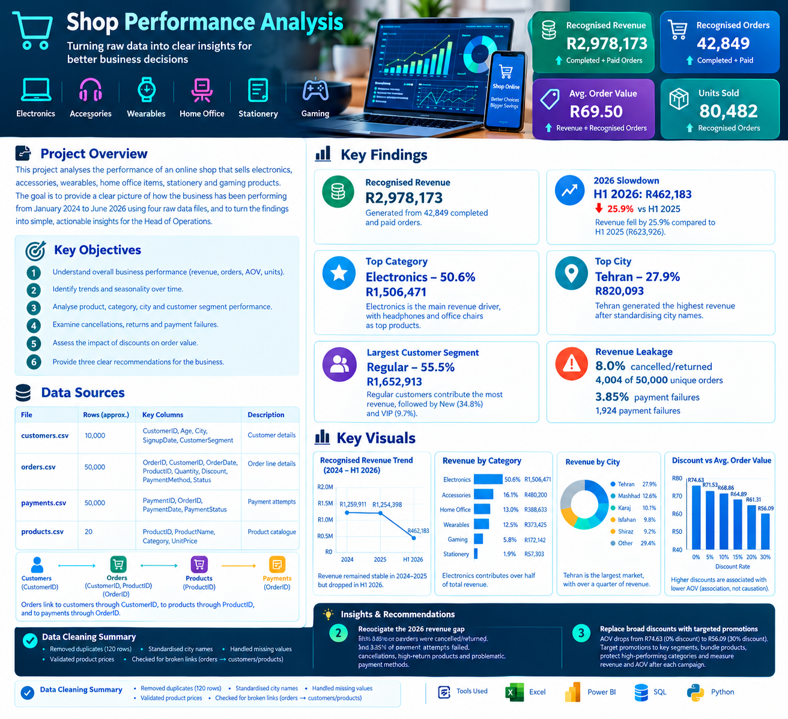
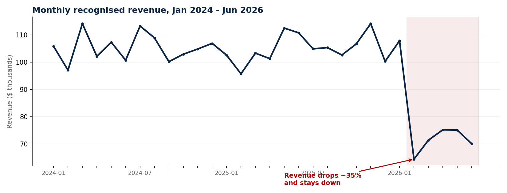
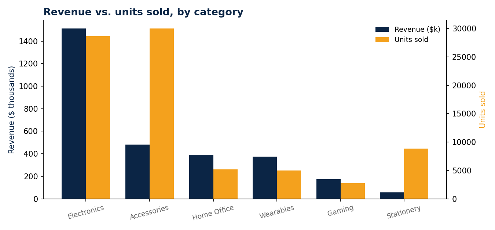

<div align="center">
  <h1>🛒 Shop Performance Analysis</h1>
  <h3>Business Analysis Case Study | January 2024 – June 2026</h3>
  <p>Turning raw business data into clear insights for better decisions.</p>
  <p><strong>SQL • Python • Excel • Power BI • Data Cleaning • Business Intelligence</strong></p>
  <br />
  <!-- Use the clean, renamed path here -->
  
</div>


------------------------------------------------------------------------

## 👋  Snapshot

> **A practical end-to-end business analytics case study showing how I
> turn messy transactional data into a management-ready story.**

This project demonstrates my ability to move from **raw data →
data-quality checks → business rules → SQL/Python analysis → Excel/Power
BI reporting → business recommendations**.

### What this project demonstrates

  -----------------------------------------------------------------------
  Capability                          Evidence in this project
  ----------------------------------- -----------------------------------
  🧹 Data Cleaning                    Duplicates, missing values,
                                      inconsistent city names, broken
                                      links and validation checks

  🐍 Python                           Data preparation, validation and
                                      analytical checks

  📊 Excel                            PivotTables, KPI analysis, trend
                                      analysis and dashboard development

  📈 Power BI                         Executive-style KPI reporting and
                                      visual storytelling

  💡 Business Analysis                Translating numbers into
                                      operational findings and
                                      recommendations

  🗣️ Data Storytelling                Plain-language findings written for
                                      a Head of Operations

  🔎 Critical Thinking                Explicit revenue-recognition rule
                                      and documented assumptions
  -----------------------------------------------------------------------

------------------------------------------------------------------------

## 📊 Executive Snapshot

| 💰 Recognised Revenue | 🛒 Recognised Orders | 🧾 Avg. Order Value | 📦 Units Sold |
| :---: | :---: | :---: | :---: |
| **R2.98M** | **42,849** | **R69.50** | **80,482** |
| **📉 H1 2026 Revenue** | **🖥️ Electronics** | **👥 Regular Customers** | **📍 Tehran** |
| **R462K** | **50.6%** | **55.5%** | **27.9%** |

**Dashboard:** [Open the live Shop Performance
dashboard](https://performance-shine-dashboard.lovable.app)

------------------------------------------------------------------------

# How Is the Shop Performing?

A data-analysis case study covering customers, orders, products
and payments for an online shop from January 2024 to June 2026.

The objective was to turn four raw datasets into a clear answer for the
**Head of Operations**: what is happening, what is driving performance,
where revenue is leaking, and what should management do next?

------------------------------------------------------------------------

## 🎯 Business Problem

The Head of Operations is not looking for technical analysis. They need
answers to five practical questions:

1.  **How much revenue is the shop generating?**
2.  **Is performance improving or declining?**
3.  **Which products, categories, cities and customer segments drive
    value?**
4.  **Where is revenue being lost?**
5.  **What actions should the business take next?**

The analysis was designed around these questions rather than around the
available columns.

------------------------------------------------------------------------

## 👥 Who This Portfolio Is For

### For recruiters and hiring managers

This project shows how I approach an unfamiliar business problem from
beginning to end --- not just how I create charts.

##### Why this exists

The Head of Operations isn't a data person. They just want to know: **is the shop doing well, and what should we do next?** This repo takes four raw CSV files — messy, like real business data always is — and turns them into a clear story: what happened, what's driving it, and three things worth doing about it.

## Who this is for

- **The Head of Operations** — read the [Headline findings](#headline-findings) and [Recommendations](#three-recommendations) below, or open `Shop_Performance_Dashboard.xlsx` and go straight to the **Dashboard** tab.
- **Anyone who wants to check the work or dig deeper** — the [Methodology](#what-we-tested) and [Data quality](#data-quality) sections below explain exactly what was done and why; the Excel file has a tab for every question, built with live formulas, not just static numbers.

### For business stakeholders

The dashboard and executive findings provide a simple view of
performance without requiring the reader to understand SQL or Python.

### For technical reviewers

The project provides traceability from raw data through cleaning,
transformation, analysis and final reporting.

------------------------------------------------------------------------

## 🔍 Headline Findings



### 1. Revenue remained relatively stable before the 2026 slowdown

Recognised revenue was broadly stable across 2024 and 2025 before
falling sharply in H1 2026.

**H1 2026 recognised revenue: R462K**

**H1 2025 recognised revenue: R624K**

This represents approximately a **25.9% decline**.

> **Business implication:** the 2026 decline requires investigation into
> order volume, acquisition, stock availability, pricing and market
> conditions.

------------------------------------------------------------------------

### 2. Electronics is the main revenue engine

Electronics contributes approximately **50.6% of recognised revenue**,
making it the most important category in the portfolio.

> **Business implication:** protect availability and performance of
> high-value Electronics products while using lower-value categories to
> support basket building.



------------------------------------------------------------------------

### 3. Tehran is the largest revenue market

Tehran contributes approximately **27.9% of recognised revenue** after
standardising inconsistent city names.

> **Business implication:** Tehran should receive particular attention
> for customer retention, promotions, service levels and market-specific
> performance.

------------------------------------------------------------------------

### 4. Regular customers are the core revenue base

Regular customers contribute approximately **55.5% of recognised
revenue**.

> **Business implication:** retaining and increasing the value of
> existing regular customers could have a meaningful impact on overall
> revenue.

------------------------------------------------------------------------

### 5. Revenue leakage is a material operational issue

Approximately **8.0% of unique orders were cancelled or returned**,
while payment failures represented approximately **3.85% of payment
attempts**.

> **Business implication:** reducing avoidable cancellations, returns
> and payment failures could recover revenue without requiring
> additional customer acquisition.

------------------------------------------------------------------------

### 6. Broad discounting does not appear to increase basket value

Average order value decreases as discount levels increase.


The relationship is **associational, not proof of causation**.

> **Business implication:** management should test targeted promotions
> and bundles instead of assuming that larger blanket discounts
> automatically create larger baskets.

------------------------------------------------------------------------

## 📌 Final Reporting KPIs

  Metric                              Final Value
  --------------------------- -------------------
  **Unique Orders**                    **50,000**
  **Recognised Orders**                **42,849**
  **Recognised Revenue**        **R2,978,172.55**
  **Average Order Value**              **R69.50**
  **Recognised Units Sold**            **80,482**
  **Cancelled + Returned**               **8.0%**
  **Payment Failures**                  **3.85%**
  **H1 2026 Revenue**                   **R462K**
  **H1 2026 vs H1 2025**               **-25.9%**

> **Reporting definition:** Recognised revenue is based on completed
> orders with a successful paid payment.

------------------------------------------------------------------------

# 🧭 What Was Tested

Following the case study requirements, I worked through the analysis as
an analyst would in a real business environment.

### 01 --- Profile the data

I reviewed:

-   Row and column counts
-   Data types
-   Missing values
-   Duplicate records
-   Numeric ranges
-   Date fields
-   Unique identifiers
-   Relationships between tables

### 02 --- Clean and validate

I checked:

-   Duplicate OrderIDs
-   Missing quantities and discounts
-   Invalid quantities
-   Inconsistent city names
-   Missing customer information
-   Product/customer/payment relationships
-   Suspicious values

### 03 --- Build the analytical dataset

The four sources were connected through:

``` text
Customers
   │
   │ CustomerID
   ▼
Orders ───────── ProductID ───────► Products
   │
   │ OrderID
   ▼
Payments
```

### 04 --- Create analytical fields

Key calculated fields included:

``` text
Gross Value
= Quantity × UnitPrice

Recognised Revenue
= Quantity × UnitPrice × (1 − Discount)

Recognised Order
= Completed AND Paid

Year
= YEAR(OrderDate)

Month
= MONTH(OrderDate)
```

### 05 --- Answer business questions

I analysed:

-   Revenue and order performance
-   Monthly trends
-   Category performance
-   Product performance
-   City performance
-   Customer segment performance
-   Cancellation and return rates
-   Payment failures
-   Discount versus order value

### 06 --- Validate the story

The final KPIs were cross-checked against the cleaned analytical dataset
before being used in the dashboard and README.

------------------------------------------------------------------------

# 🚦 What's Actually Driving This?

## The 2026 decline is primarily an order-volume problem

The most important finding is not simply that revenue fell.

The business needs to know **why**.

The analysis shows a sustained reduction in order activity during H1
2026 while the cancellation and payment-failure mix remained within a
relatively normal range.

That shifts the investigation upstream toward:

-   Customer acquisition
-   Marketing activity
-   Stock availability
-   Pricing
-   Website/app traffic
-   Competitor activity
-   Market conditions

**The dataset cannot prove which of these caused the decline**, so I
have deliberately presented them as investigation areas rather than
unsupported conclusions.

------------------------------------------------------------------------

## Electronics drives value while other categories drive volume

Electronics contributes more than half of recognised revenue.

This creates an important management trade-off:

> **Volume is not the same as value.**

A category can sell many units without being the largest contributor to
revenue.

This is why the analysis separates:

-   Revenue
-   Units
-   Average order value
-   Category contribution

------------------------------------------------------------------------

## Discounts should be evaluated by business outcome

Rather than simply reporting which discount tier was used most often, I
tested whether higher discounts were associated with larger baskets.

The data does not show evidence that larger discounts automatically
produce larger order values.

This supports a more disciplined promotion strategy:

> **Measure incremental revenue and basket value --- not discount
> activity alone.**

------------------------------------------------------------------------

# 💡 Three Recommendations

### 1. Investigate the H1 2026 order-volume decline

Break the decline down by:

-   Month
-   Product
-   Category
-   City
-   Customer segment
-   Payment method

Then compare the period with marketing activity, stock availability,
pricing and website/app performance.

**Priority: HIGH**

------------------------------------------------------------------------

### 2. Reduce revenue leakage

Focus on:

-   Cancellation reasons
-   Return reasons
-   Failed payments
-   Payment gateway performance
-   High-return products
-   High-cancellation customer/product combinations

**Priority: HIGH**

------------------------------------------------------------------------

### 3. Replace blanket discounts with targeted promotions

Test:

-   Product bundles
-   Category-specific promotions
-   Customer-segment offers
-   VIP/Regular retention offers
-   Cross-selling accessories with Electronics

Measure each campaign against:

-   Revenue
-   AOV
-   Units per order
-   Margin where available
-   Repeat purchasing

**Priority: MEDIUM--HIGH**

------------------------------------------------------------------------

# 🧹 Data Quality

Real business data is messy. I treated data quality as part of the
analysis rather than as a separate technical exercise.

  -----------------------------------------------------------------------
  Issue                   Finding                 Treatment
  ----------------------- ----------------------- -----------------------
  Duplicate OrderIDs      Duplicate order records Removed duplicate
                          identified              OrderID records

  Missing quantity        Missing/invalid         Not invented; affected
                          quantity values         calculations flagged

  Missing discount        Blank discount values   Not silently guessed in
                                                  the analytical dataset

  Missing payment method  Blank payment methods   Retained and flagged

  Inconsistent city       `Tehran`/`tehran`,      Standardised
  spelling                `Mashad`/`Mashhad`      

  Missing customer links  Some OrderIDs reference Retained and flagged
                          unavailable customers   

  Product links           ProductID relationships Validated
                          checked                 

  Payment links           OrderID/payment         Validated
                          relationships checked   

  Suspicious values       Unusual numeric/product Flagged for business
                          values investigated     review
  -----------------------------------------------------------------------

### Why this matters

A polished dashboard is only as reliable as the data behind it.

My approach was:

> **Validate → document → decide → calculate → cross-check → report.**

------------------------------------------------------------------------

# 🧠 Analytical Thinking Demonstrated

This project demonstrates several behaviours I would bring to a Data
Analyst / Business Analyst role:

### I don't just calculate --- I define the business rule

For example:

> What should count as revenue?

I explicitly defined:

``` text
Status = Completed
AND
PaymentStatus = Paid
```

before calculating recognised revenue.

### I distinguish facts from assumptions

For example:

> The dataset shows a revenue decline.

That is a **fact**.

> Marketing caused the decline.

That would be an **unsupported assumption** without additional marketing
data.

This distinction is important when presenting analysis to management.

### I connect technical work to business decisions

Instead of ending with:

> "Electronics = 50.6%."

I translate it into:

> "Electronics is the core revenue engine, so stock availability and
> product performance in this category deserve priority attention."

------------------------------------------------------------------------

# 🛠️ Tools & Technologies

  -----------------------------------------------------------------------
  Tool                                How I Used It
  ----------------------------------- -----------------------------------
  **SQL**                             Data querying, joins, aggregation,
                                      filtering and KPI analysis

  **Python**                          Data preparation, validation and
                                      analytical checks

  **Excel**                           PivotTables, KPI calculations,
                                      trend analysis and dashboard

  **Power BI**                        Interactive business intelligence
                                      and visual storytelling

  **GitHub**                          Version-controlled portfolio
                                      documentation

  **Lovable**                         Interactive dashboard presentation
  -----------------------------------------------------------------------

------------------------------------------------------------------------

# 📁 Project Structure

``` text
.
├── README.md
├── Shop_Performance_Dashboard.xlsx
├── assets/
│   ├── banner.png
│   ├── monthly_revenue_trend.png
│   ├── category_revenue_units.png
│   └── discount_vs_aov.png
│
└── data/
    ├── raw/
    │   ├── customers.csv
    │   ├── orders.csv
    │   ├── payments.csv
    │   └── products.csv
    │
    └── cleaned/
        ├── customers_clean.csv
        └── orders_clean.csv
```

------------------------------------------------------------------------

# 📊 Excel Deliverable

The Excel workbook is structured around the business questions rather
than around the raw tables.

  -----------------------------------------------------------------------
  Tab                                 Purpose
  ----------------------------------- -----------------------------------
  **Overview**                        Project purpose, methodology and
                                      navigation

  **Dashboard**                       Executive KPI cards, visuals,
                                      findings and recommendations

  **Monthly_Trend**                   Revenue trend and H1 2026
                                      performance

  **Category_Product**                Category and product revenue versus
                                      units

  **Geography_Segment**               City and customer-segment
                                      performance

  **Ops_Quality**                     Cancellations, returns and payment
                                      failures

  **Discount_Analysis**               Discount versus AOV and order
                                      behaviour

  **Data_Quality**                    Cleaning decisions and validation
                                      checks

  **Orders_Clean**                    Cleaned analytical order-level
                                      dataset
  -----------------------------------------------------------------------

------------------------------------------------------------------------

# 🔄 End-to-End Analytical Workflow

``` text
BUSINESS QUESTION
       ↓
RAW DATA
       ↓
DATA PROFILING
       ↓
DATA QUALITY CHECKS
       ↓
CLEAN & STANDARDISE
       ↓
JOIN CUSTOMERS + ORDERS + PRODUCTS + PAYMENTS
       ↓
CREATE BUSINESS METRICS
       ↓
SQL / PYTHON ANALYSIS
       ↓
EXCEL / POWER BI VISUALISATION
       ↓
IDENTIFY KEY FINDINGS
       ↓
BUSINESS RECOMMENDATIONS
       ↓
MANAGEMENT DECISION
```

------------------------------------------------------------------------

# 📈 Portfolio Outcome

This project demonstrates an end-to-end analytics workflow:

**Raw Data → Clean Data → Analysis → Visualisation → Insight →
Recommendation**

The goal was not simply to produce a dashboard.

The goal was to answer:

> **"What is happening in the business, why does it matter, and what
> should management do next?"**

------------------------------------------------------------------------

## 📚 Case Study Deliverables

-   ✅ Cleaned analytical dataset
-   ✅ Data-quality assessment
-   ✅ SQL analysis
-   ✅ Python validation and analysis
-   ✅ Excel PivotTable analysis
-   ✅ Executive dashboard
-   ✅ Power BI reporting
-   ✅ Business insights
-   ✅ Management recommendations
-   ✅ GitHub documentation

------------------------------------------------------------------------

## ⭐ Takeaway

> **This project demonstrates my ability to take an ambiguous business
> question, work through messy data, establish defensible business
> rules, analyse performance across multiple dimensions, communicate
> findings clearly, and turn analysis into practical recommendations.**

**That's the skill I am building toward as a Data Analyst / Business
Analyst.**

------------------------------------------------------------------------

### 📌 Related Skills

`SQL` `Python` `Pandas` `Excel` `Power BI` `Data Cleaning`
`Data Validation` `Data Analysis` `Business Intelligence` `KPI Analysis`
`Data Storytelling` `Dashboard Development` `Business Analysis`


---
